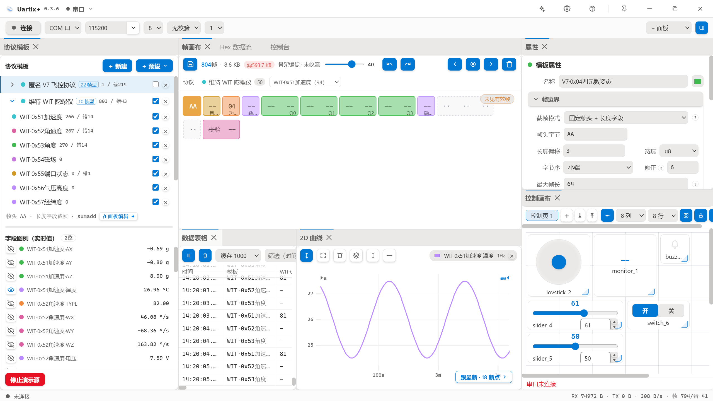

<div align="center">


# Uartix+

### 嵌入式可视化上位机

拖拽定义协议 · 实时解析可视化 · 双向闭环调试

*A visual host-computer suite for embedded systems*

<br/>

[![Release][badge-rel]][get-it]
[![Download][badge-dl]][get-it]
[![License][badge-li]][license]
[![Platform][badge-pf]][get-it]
[![Tauri][badge-ta]][tauri]

<br/>

**[下载安装](#下载)** · **[快速上手](#快速上手)** · **[官网][website]** · **[English](README.en.md)**

</div>



---

## 它是什么

Uartix+ 是一台跑在电脑上的**上位机**。向下连接单片机、惯导、云台、机器人这些下位机，向上把一串串看不懂的原始字节变成结构、数值、曲线和画面，再把你的操作回写成设备能够接受的指令。

它不是只会收发字符的串口助手：**协议无需编写解析代码**，在数据流上框选字节即可定义帧结构与字段含义；**界面无需编写界面代码**，拖拽控件就能拼出专属调试台。连接、校验、测量、可视化、脚本自动化与数据导出，在同一处完成闭环。

| | 传统串口助手 | 波形工具 | **Uartix+** |
|---|:---:|:---:|:---:|
| 收发原始数据 | ✅ | 部分 | ✅ |
| 自定义二进制协议解析 | 写死或写脚本 | 需按约定格式 | **拖拽定义，零代码** |
| 帧结构可视化 | ❌ | ❌ | **逐字节着色画布** |
| 下发控制指令 | 手动输入 | 基础控件 | **控件 + 指令工厂 + 脚本** |
| 帧级表格与导出 | ❌ | ❌ | ✅ |
| 双游标测量 / 指针读数 | ❌ | 基础 | **时间尺 + 幅度尺** |
| 图传画面与遥测同屏 | ❌ | ❌ | ✅ |
| AI 生成组件与执行操作 | ❌ | ❌ | **内置（v0.3.6 起）** |

---

## 核心能力

### 协议解析引擎

在 Hex 数据流上框选一段字节，右键即可定义为帧头、长度位、识别位、载荷或校验域，字段尺寸随类型自动伸缩。真实私有协议往往只靠帧头无法区分帧型，因此做了两级识别：任意字段可开启「帧识别位」，用功能码级别的多字节值精确匹配；多个模板对同一路数据流并行匹配，互不干扰。

<details>
<summary><b>展开技术细节</b>（校验算法 / 字段类型 / 文本流 / 预设）</summary>

- **校验引擎**：Sum8 / XOR8 / CRC16-Modbus / CRC16-CCITT / CRC32，覆盖区间支持负偏移，便于排除末尾校验字节本身
- **字段类型**：u8 / i8 / u16 / i16 / u32 / i32 / f32 / f64，另有 ASCII / BCD / 位域；大小端可切，缩放与偏置改完立即生效
- **文本流同样当协议处理**：帧头允许为空，按分隔符自适应切分通道，通道数随每帧实际段数动态变化
- **预设模板**：WitMotion JY901、匿名 V7、Modbus、CSV 文本流；协议可导出 JSON 与同事互换
- **协议簇管理**：一个协议一个页签，内含多帧型，支持右键复制 / 粘贴 / 重命名 / 导出

</details>

### 数据可视化

解析出的字段自动注册为变量，点一下图例上的眼睛就能画成曲线。2D 曲线配备时间尺与幅度尺两条独立游标做 A−B 差值测量，指针十字贴近曲线交点显示原始读数；长时间采集由峰谷保形抽稀维持流畅，而游标、表格与导出使用的始终是全量数据。

<details>
<summary><b>展开各面板能力</b>（2D 曲线 / 3D 姿态 / 图传 / 帧画布 / 表格 / 控制台）</summary>

- **2D 曲线**：直线 / 阶梯 / 样条线型，相对秒时间轴（0s / 60s / 1.2h），最新线锚定曲线真实末点，Y 轴自动贴合 + 一次性 Auto 键
- **3D 姿态**：欧拉角 / 四元数双模式，六种旋转顺序与三轴取反，四轴飞行器与立方体模型，可跨协议模板绑定字段
- **图传面板**：把数据帧实时渲染成画面，支持网络图传源，可暂停 / 回看 / 保存单帧 / 镜像 / 翻转
- **帧画布**：逐字节着色，悬停看属性，右键插入 / 删除帧格，骨架态附「未见有效帧」排查提示
- **数据表格**：虚拟列表、排序筛选、导出 CSV / Excel
- **控制台**：Hex / ASCII / 时间戳多视图，收发分色
- **演示源**：没有硬件也能体验全部功能

</details>

### 下行控制

控制画布拖拽控件即成调试面板，落点带幽灵框，碰撞检测加就近吸附，卡片永不重叠。指令工厂负责可视化组帧，把「发什么字节」这件事从手敲十六进制里解放出来。

<details>
<summary><b>展开控件与指令能力</b>（画布 / 键盘遥控 / 指令工厂 / 脚本）</summary>

- **控件**：滑条 / 按钮 / 开关 / 多档开关 / LED / 数值监视 / 蜂鸣器 / 摇杆，支持复制粘贴与网格对齐
- **键盘遥控**：卡片锁定 n×n 方阵，按键映射成指令，脚本模式可按方向分支发送不同内容
- **指令工厂**：内置 WIT 写寄存器（自动解锁 → 写入 → 保存）、匿名 V7 功能触发与参数读写、Modbus RTU、校验工具；「我的协议」可自建帧模板并实时分段预览
- **快捷指令栏**：命令芯片点击即发，悬停预览实际字节
- **脚本与变量**：类 C 脚本，解析字段自动成为变量，指令模板用 `%x` 占位，可调用 `send` / `beep` / `delay_ms`

</details>

### 连接与性能

数据接口覆盖串口 / TCP 客户端 / TCP 服务端 / UDP，四者共用同一条解析管线，网络数据源享有完整功能。串口拔出两秒内自动检测断开，重插即恢复，网络断联同样自动重连。

<details>
<summary><b>展开工程特性</b>（性能机制 / 布局 / 主题语言 / 更新）</summary>

- **二进制 IPC**：帧数据经 Tauri Channel 直推 ArrayBuffer，绕开 base64 与 JSON 开销
- **面板生命周期门控**：关闭即停后台搬运，堆叠面板的后台标签只缓冲不渲染
- **归档池水位线回收**：数十万帧长跑不卡
- **布局**：四套预设工作区 + 自定义布局槽位（另存 / 切换 / 删除）
- **主题**：九套主题色卡，默认海棠，深浅完整覆盖
- **语言**：中英双语深入各面板，切换即时生效（协议名、字段名等用户数据保持原文）
- **数据流转**：协议 / 控制画布 / 命令库均可 JSON 互传，内置自动更新

</details>

### AI 助手

自 v0.3.6 起，AI 不再是聊天框里的问答，而是应用内的引擎。

- **对话即创造**：生成协议模板 / 控制卡片 / 命令库 / 指令工厂协议 / 主题 / 全局样式 / 停靠面板 / 沙箱小部件 / 无边框挂件 / 直接执行动作 / 高权限脚本，共十种输出块，全部以确认卡片一键安装
- **说出来即发生**：打开面板、切换布局、连接串口这类操作由 AI 直接执行，走 27 个白名单动作，破坏性操作红标并保留人工确认
- **一切皆 API**：沙箱组件自动注入 `window.uartix`——键盘 / 光标监听、AI 思维链感知、向 AI 提问、自定义右键菜单、窗口控制、挂件互感广播、语音播报、主题订阅
- **无边框形态**：透明窗口、按住即拖、松开吸附停靠、边界钳制，可做悬浮仪表盘 / 通知条，也可以做一只桌面宠物（后者只是示例玩法，能力完全通用）
- **过程可见且安全**：思维链多段流式展示，内容未生成完毕不给安装按钮；沙箱组件实时跟随全局换肤

---

## 快速上手

1. 选择串口与波特率连接设备，或在顶部切换 TCP / UDP 网络源；手边没有设备就启动演示源
2. 在 Hex 数据流上拖拽框选一帧开头的固定字节，右键「设为帧头」
3. 继续框选长度位、载荷与校验域，在右侧属性面板调整字节序 / 类型 / 缩放；功能码字段可开启「帧识别位」区分帧型
4. 字段解析成功后自动注册为变量，点图例眼睛画曲线，3D 面板绑欧拉角看姿态
5. 打开控制画布拖入控件做双向调试，或在控制台用指令工厂组帧下发寄存器命令
6. 也可以直接把需求讲给 AI 助手，例如「帮我定义这个协议」「做一个无边框悬浮温度计」

---

## 下载

以下链接**永远指向最新版**：

| 平台 | 固定地址 |
|---|---|
| Windows x64 | [Uartix-Plus-windows-x64-Setup.exe][dl-win] |
| Linux AppImage | [Uartix-Plus-linux-x64.AppImage][dl-appimage] |
| Linux deb | [Uartix-Plus-linux-x64.deb][dl-deb] |

历史版本与完整变更见 [Releases][get-it]，教程与文档见 [官网][website]。

> **安装提示** — Windows 首次运行若被 SmartScreen 拦截，点「更多信息」再选「仍要运行」。
> Linux AppImage 需系统装有 `libfuse2`（`sudo apt install libfuse2`），deb 用 `sudo dpkg -i` 安装。
> 已安装用户直接在应用内「设置 → 检查更新」升级即可。

---

## 从源码构建

```bash
# 依赖：Node.js 18+ · Rust 1.77+ · WebView2 (Win) / WebKitGTK (Linux)
npm install
npm run tauri dev      # 开发
npm run tauri build    # 产出安装包 (src-tauri/target/release/bundle/)
```

Linux 构建依赖：

```bash
sudo dnf install libwebkit2gtk-4.1-devel build-essential libxdo-devel \
  openssl-devel libayatana-appindicator3-devel librsvg2-devel
```

提交前请通过 `cargo test`（Rust 侧 20 个用例）与 `npx tsc --noEmit`。

<details>
<summary><b>项目结构</b></summary>

```
src/
  features/
    ai/             AI 助手：对话与流式渲染、十种块安装、uartix 注入桥、挂件宿主、扩展库
    protocol/       协议模板引擎、拖拽框选定义、属性面板
    framecanvas/    Hex 帧画布（Canvas 渲染 + 虚拟化 + 归档池）
    controls/       控制画布、控件、命令库、脚本
    console/        控制台、快捷指令栏、指令工厂
    settings/       设置中心、布局槽位、导入导出
    serial/         串口 / 网络会话状态
    table/ plot/ view3d/ hexview/ video/ help/
  i18n/             中英双语（中心键 + 就近双语）
  panels/           dockview 面板注册表
  shell/            自绘标题栏、应用外壳
  shared/           图标、通用组件、字节解析工具
src-tauri/          Rust：串口、TCP / UDP、并行协议解析、校验、AI 流式转发、文件 IO
```

</details>

---

<div align="center">

**Issue / PR 都欢迎。** 提交前请确保 `cargo test` 与 `npx tsc --noEmit` 均通过。

[![GitHub issues][badge-is]][issues] · [官网][website] · [English README](README.en.md)

Made with Rust + Tauri 2 + React · **MIT** [License][license]

</div>

<!-- ── 链接与徽章 ─────────────────────────────────────────── -->

[website]: https://larix.teuioe.cn/uartix-plus
[get-it]: https://github.com/Tanixs/uartix-plus/releases/latest
[issues]: https://github.com/Tanixs/uartix-plus/issues
[license]: LICENSE

[dl-win]: https://github.com/Tanixs/uartix-plus/releases/latest/download/Uartix-Plus-windows-x64-Setup.exe
[dl-appimage]: https://github.com/Tanixs/uartix-plus/releases/latest/download/Uartix-Plus-linux-x64.AppImage
[dl-deb]: https://github.com/Tanixs/uartix-plus/releases/latest/download/Uartix-Plus-linux-x64.deb

[badge-rel]: https://img.shields.io/github/v/release/Tanixs/uartix-plus?label=version&color=2ea44f&logo=github
[badge-dl]: https://img.shields.io/github/downloads/Tanixs/uartix-plus/total?label=downloads&color=007ec6&logo=github
[badge-li]: https://img.shields.io/badge/license-MIT-blue.svg
[badge-pf]: https://img.shields.io/badge/platform-Windows%20%7C%20Linux-lightgrey
[badge-ta]: https://img.shields.io/badge/built%20with-Tauri%202-24C8DB?logo=tauri
[badge-is]: https://img.shields.io/github/issues/Tanixs/uartix-plus?color=yellow
[tauri]: https://v2.tauri.app/
