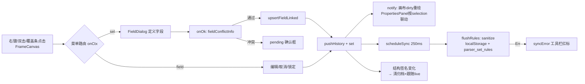
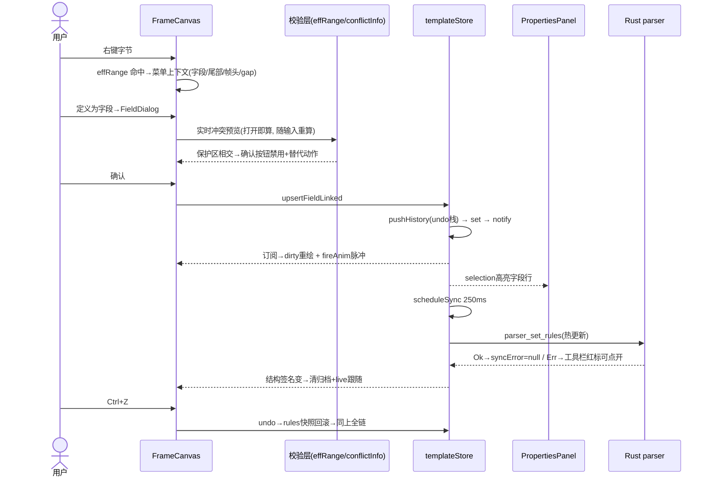

# P85 · 帧画布交互规则与布局优化方案（仅方案，未动代码）

日期：2026-09-16 ｜ 状态：待用户确认 ｜ 前置：P83（结构签名/覆盖条/对比基线）、P83b（指针拖拽）

---

## 一、源码现状分析

### 1.1 关键文件与职责

| 文件 | 职责 |
|---|---|
| `src/ipc/types.ts:112-207` | 数据模型：`FieldRole`（10 种角色）、`FieldDef`（offset 负数=距帧尾锚定；`spanTail/spanElem` 变长载荷；`locked`；`disc` 识别位）、`Boundary`（三种成帧模式）、`ChecksumCfg`（algo + coverageStart/End，负终点=距帧尾）、`FrameTemplate` |
| `src/features/framecanvas/frameLayout.ts` | 纯布局函数：`buildBlocks`（帧→hdr/fld/ftr/gap 块序列，含负偏移解析、变长校验域重锚定、spanTail 伸缩）、`reservedTail = checksumTail + footerTail`、`skeletonLen`（无流时骨架长度）、`coverageRuns`（P83 覆盖条）、`layoutBlocks`（折行） |
| `src/features/framecanvas/FrameCanvas.tsx`（2595 行） | 面板主体：Canvas paint（669）、tooltip（1037）、命中 `hitOffset`（1186）、选择拖拽（onDown/onMove/onUp）、右键路由 `onCtx`（1329）、四类菜单（1838-1956）、`FieldDialog`（2215）、`HeadTailDialog`（2088）、冲突确认 `pending`（1961）、撤销重做入口（1461/1520）、结构签名→清归档（1397）、CoverageStrip（339） |
| `src/features/protocol/templateStore.ts` | 单一事实源：`rules` 快照 + selection/hexSelection/syncError + undo/redo 栈（JSON 快照，深 50）；`fieldConflictInfo`（87）、`insertFrameCell/deleteFrameCell`（744/779）、`upsertFieldLinked`（883，LEN 联动 + 校验配置联动）、`removeField`（989，telemetry/plot 清理）、`scheduleSync` 250ms → `flushRules`（sanitize + localStorage + `parser_set_rules` 热更新，失败→`syncError`） |
| `src/features/protocol/PropertiesPanel.tsx` | 右侧属性面板，订阅 `selection`：模板态（边界/校验/字段列表）、字段态（名称/角色/偏移/类型/…，`commitSized` 带冲突确认，校验域「一键修到帧尾」） |
| `src-tauri/src/parser.rs` | 内核：`validate`（634-662，负偏移界内、校验字段宽度=算法宽度）；`verify`（666-733，**校验域位置的最终裁决**，见 1.3）；`decode_fields`（1035，负偏移按 `帧长+offset` 逐帧解析） |
| `src/features/hexview/HexView.tsx:743-817` | Hex 选区右键「定义为字段」→ `addFieldFor` 直接 `templateStore.addField`，**不走冲突检测** |
| `src/styles/theme.css:3972-4025` | `.fc-menu`（min-width 180/nowrap）、`.fc-dlg`（**width:340px 固定**）、`.fc-dlg-roles`（**flex-column → 锚点两按钮竖排**）、`.modal`（对照：560px 自适应） |

### 1.2 数据流 / 事件流（现状）

### 1.3 核心结论：校验位是固定帧尾还是可移动？（问题 B1 的答案）

`parser.rs: verify()` 的 exp_off 判定（前端 `buildBlocks:137-142` 完全同构）：

1. 有 role=checksum 字段且 **offset<0** → `帧长+offset`，逐帧随帧长浮动（**帧尾锚定**）；
2. 有 role=checksum 字段且 **fixedLength 模式** → 用字段 offset 原值（**可移动**，但 PropertiesPanel 已有「偏移+宽度≠帧长」警告 + 一键修到帧尾）；
3. 有 role=checksum 字段且 **变长模式（lengthField/footer）** → 引擎**强制** `帧长−校验宽度−帧尾字节数`，字段存的偏移只是画布标注（**帧尾固定，移动无效**）；
4. 无校验字段 → `coverageEnd`（负数=距帧尾）。

**结论：校验域语义上永远是「尾部域」**。变长帧物理固定在帧尾；定长帧允许偏移但偏离帧尾即为错误配置（已有纠偏 UI）。因此画布应把 `reservedTail`（校验配置+帧尾字节）覆盖的字节视为**保护区**——这正是当前缺失的规则。

### 1.4 现状缺陷清单（与问题 B 对应，全部有源码证据）

| # | 缺陷 | 证据 |
|---|---|---|
| ① | `findFieldAt` 只按原始 `f.offset` 匹配，**负偏移字段与变长帧被重锚定的校验字段永远命不中** → 右键尾部字节不出「字段菜单」（无法编辑/取消/锁定），悬停无字段高亮环（hover 环走 `findFieldAt`），即用户所说「最后一个字段不可悬停选中、不可编辑」 | FrameCanvas.tsx:1321-1327, 786-792 |
| ② | `fieldConflictInfo` 正偏移路径只比较 `f.offset > nextOffset` 的字段，**负偏移字段被无视**；也**不检查 reservedTail** → 「定义为字段」可静默压在帧尾校验域上，buildBlocks 里新字段把 ftr 块吃掉（pos 推到帧尾后 tailStart=max(pos,…) 长度归 0），即「新建字段覆盖原校验字段」 | templateStore.ts:98-121; frameLayout.ts:168-171 |
| ③ | `coverageRuns` 跳过 `offset<0` 字段 → 覆盖条把已定义的尾部字段标成「未覆盖缺口」，点击缺口直接诱发 ② 的重复定义 | frameLayout.ts:62 |
| ④ | `deleteFrameCell` 占用判定是 `g > f.offset`，**删除字段首字节被放行**且该字段不位移 → 字段静默吞掉后一字节，数据错位 | templateStore.ts:788-794 |
| ⑤ | HexView「定义为字段」`addField` 零校验：可与既有字段/帧头/尾部区重叠 | HexView.tsx:768-777 |
| ⑥ | 插入格在 `g==fixedLength`（末尾追加）被拒；帧尾扩展只能去属性面板改总帧长 | templateStore.ts:751 |
| ⑦ | 插入/删除格仅 fixedLength 模式显示且**整项隐藏**，变长模式用户以为功能缺失（实为语义上无意义）→ 缺解释 | FrameCanvas.tsx:1843-1882 |
| ⑧ | 帧头字节悬停只有 tooltip+下边线，无选中框；单击把 selection 置为模板级（看起来「不可编辑」，实际要双击/右键才出编辑入口） | FrameCanvas.tsx:1311-1312, 1635-1650 |
| ⑨ | 菜单/提示里使用 `⨯ 🔒 🔓 ⤒ ✓` 字符图标 —— 违反项目红线（界面图标一律 lucide SVG） | FrameCanvas.tsx:1907,1916,1866; theme.css:1743 |
| ⑩ | 弹窗固定 340px：锚点按钮被 `.fc-dlg-roles` 排成竖列；「变长载荷」勾选行+长说明挤在一行 | theme.css:3981,4014 |

---

## 二、问题清单与优先级

**P0（规则正确性，先做）——「P85a 尾部域与命中一致性」**
1. 统一「有效区间」原语 `effRange(tpl, f, frameLen)`（负偏移解析 + 变长校验重锚定 + spanTail 伸缩），`findFieldAt`/hover 环/`onCtx`/tooltip 全部改用它 —— 修 ①⑧ 的可编辑性一半。
2. `fieldConflictInfo` 升级：按有效区间比较（含负偏移字段）；新增 `overTail` 冲突类（与 reservedTail 相交）；`overFrame` 用当前帧长/fixedLength 而非 maxLength —— 修 ②。
3. 「定义为字段」遇尾部冲突：**硬拦截 + 给出替代动作**（详见第四节菜单表），不再出现「覆盖并继续」。
4. `coverageRuns` 计入负偏移/重锚定字段 —— 修 ③。
5. `deleteFrameCell` 占用判定改 `g >= f.offset && g < f.offset+sz`；`insertFrameCell` 允许 `g==fixedLength` 帧尾追加 —— 修 ④⑥。
6. HexView `addFieldFor` 改走同一冲突校验（冲突则禁用按钮 + title 说明）—— 修 ⑤。

**P1（交互补全）——「P85b 右键菜单与反馈」**
7. 尾部字段（负偏移/锚定校验）右键出「字段菜单」：编辑/取消定义/锁定 + 「校验配置」入口。
8. 插入/删除格项在变长模式**置灰显示 + 原因 tooltip**（「变长帧帧长由长度域/帧尾决定，请改截帧配置」），不再整项隐藏；补「向后插入格」；定长模式菜单给出帧长上下文 —— 修 ⑦。
9. 菜单/提示字符图标全部换 lucide SVG —— 修 ⑨。
10. 冲突预览：FieldDialog 打开时即按当前选区/编辑值显示红色横幅（名称/类型/锚点变更实时重算），替代保存后才发现。
11. 表→画布反向定位：属性面板字段行点击后画布滚动到该字段并 220ms 脉冲（复用 `fireAnim`）。

**P1（布局）——「P85c 弹窗与菜单布局」**
12. FieldDialog/HeadTailDialog 自适应宽度（见第五节）。
13. 锚点两选项 → 横向分段控件。
14. 「自动延长数据载荷」层级重排 + HelpHint。
15. 角色 chip 区、校验算法 hint、帧识别等同类拥挤项一并梳理。
16. 弹窗补 `role=dialog`/`aria-modal`/焦点圈定（对齐 pending 框已有的 a11y 水准）。

**P2（打磨，可选搭车）**
17. Esc 选择层级：选中字段后按 Esc 退到模板级（Figma 式）；字段态 selection 时画布左上角显示面包屑「模板 › 字段 › Esc 上钻」。
18. 骨架态（无流）与实帧态下尾部/锚点行为差异提示统一。
19. PropertiesPanel 字段列表 `@-3` 显示为「距尾3B」。

---

## 三、交互规则设计表：字段类型 × 操作能力

图例：✅ 支持｜⚠️ 有条件｜🚫 禁止（显示原因）｜✏️ 属性面板。**「悬停环」列 = 现状缺失需补的统一规则：一切可点选区域都有 hover 反馈。**

| 区域/类型 | 悬停高亮 | 单击选中 | 右键菜单 | 编辑 | 取消定义 | 前插格 | 后插格 | 删格 | 新建字段可压 | 可锁定 |
|---|---|---|---|---|---|---|---|---|---|---|
| 帧头字节（boundary.headerBytes） | ✅（现状仅下边线→补整块描边） | ✅→模板属性 | ✅ 帧头菜单（编辑帧头/增删字节/掩码） | ✅ 弹窗/属性面板 | 🚫（结构非字段，去字节走帧头弹窗） | 🚫 定长模式提示「用帧头编辑改字节数」 | 同左 | 🚫（现状已有守卫） | 🚫（现状 buildBlocks 隐藏压入字段，需补冲突提示） | — |
| 帧尾字节（footer 模式 footerBytes） | ✅ | ✅→模板属性 | ✅ 帧尾菜单（编辑帧尾字节） | ✅ | 🚫 | 🚫 | 仅定长模式=帧尾追加 | 🚫 | 🚫 保护区（新） | — |
| 校验域（配置驱动、无字段） | ✅ | ✅→模板属性 | ✅（现「校验尾」灰项）→ 补「配置校验…」「转为字段」 | ✅ 属性面板校验区 | — | 定长：🚫 提示先删校验 | 同左 | 🚫 | 🚫 保护区（新）：提示「此区为校验域」+ 按钮「取消校验后定义」 | — |
| 普通字段（正偏移定长） | ✅（现状有环） | ✅→字段属性 | ✅ 现 field 菜单 | ✅ 弹窗/面板 | ✅（telemetry/plot 清理，现状已有） | ✅ 仅整字段边界（g==offset） | ✅ | ✅ | 允许重叠但需确认（bits 例外，见注） | ✅ |
| 尾部锚定字段（offset<0） | **✅ 补（现状无环）** | **✅ 补** | **✅ 补 field 菜单** | ✅ | ✅ | 语义不适用→🚫 提示 | 同左 | 同左 | 🚫 保护区（新） | ✅ |
| 校验字段 CK1（变长帧=引擎强制锚尾） | **✅ 补** | ✅ | **✅ 补**：编辑/锁定/「查看校验配置」；「取消定义」需二次确认并联动提示 | ✅（宽度受算法锁定） | ⚠️ 取消=同时 setChecksumAlgo(none) 或提示 | 🚫 | 🚫 | 🚫 | 🚫 | ✅ |
| CK2 | ✅ | ✅ | ✅ field 菜单 | ✅ | ✅ | 同 CK1 | 同 | 同 | ⚠️ 允许压 CK1 区（本就是视觉标注），提示 | ✅ |
| LEN 字段（lengthField 模式） | ✅ | ✅ | ✅ + 「同步到截帧配置」说明（现状 upsertFieldLinked 已双向联动） | ✅ 面板「长度域」行 | ⚠️ 删除时若 lengthOffset 仍指它→提示改配置 | 🚫 长度偏移前插格=字段右移，允许但提示联动 | ⚠️ | ⚠️ | 🚫 | ✅ |
| 变长载荷 spanTail | ✅（跨格连续性现状已保） | ✅ | ✅ | ✅ | ✅ | ✅（其后字段自动让位，ruler 联动） | ✅ | ⚠️ 删至零长禁止 | ⚠️ 与后字段冲突→确认 | ✅ |
| bits 字段 | ✅ | ✅ | ✅ | ✅ | ✅ | ✅ | ✅ | ✅ | **✅ 同字节多 bits 字段是合法用例**（冲突检测需放行 type=bits 对） | ✅ |
| 未定义字节（gap） | ✅（crosshair） | ✅ 框选 | ✅ sel 菜单 | — | — | ✅（定长） | ✅ | ✅（定长，删后 gap 缩） | ✅ 主路径 | — |
| 锁定字段 | ✅ | ✅ | 编辑 ✅｜取消 🚫（现有）｜解锁 ✅ | — | — | 🚫（现状未检查 locked！补） | 🚫 | 🚫 | 🚫 | — |

> 注：bits 例外规则——同字节重叠仅当**全部重叠方都是 `type:"bits"`** 时免确认；任一方非 bits 走「覆盖并继续」确认。依据：位段分解（一个字节拆 8 个开关）是现有 `BitsCfg` 的正当用法。

---

## 四、右键菜单设计表

统一原则：①所有菜单项常显，不适用时**置灰 + title 写原因**（VS Code 惯例），不再整项隐藏；②每项带快捷键提示（若有）；③字符图标全部换 SVG。

| 上下文 | 菜单项 | 启用条件 | 行为 | 反馈 | 可撤销 |
|---|---|---|---|---|---|
| gap 字节/框选（定长） | 定义为字段… | 选区不与保护区相交 | FieldDialog（预填 lo/size） | 冲突实时预览横幅 | ✓ |
| | | 与保护区相交 | 🚫→项改为「此处是校验/帧尾域」+ 子按钮「取消校验后定义」「跳到属性面板」 | toast 说明 | ✓ |
| | 在此格前插入格（+1） | 定长 && 不在字段内部（g==字段起点现允许=插到字段前，保持） | fixedLength+1，offset≥g 的字段整体右移 | 画布脉冲动画；LEN/disc 联动（setLengthDomain 语义保持） | ✓ |
| | 在此格后插入格（+1）**新** | 定长 && g 后无字段占位 | 同上（g+1） | 同上 | ✓ |
| | 帧尾追加格（+1）**新** | 定长 && 点在最后一格 | fixedLength+1，不移动任何字段 | 同上 | ✓ |
| | 删除此格（−1） | 定长 && 不在任何字段内部（含起点，修正④）&& 删后帧长≥帧头+1 && 不在保护区 | fixedLength−1，offset>g 左移 | 同上 | ✓ |
| | （变长模式上列三项） | 常显置灰 | — | title：「变长帧帧长由长度域/帧尾决定 → 请到属性面板改截帧配置」 | — |
| | 取消选择 (Esc) | 恒有 | 清选区 | — | — |
| 普通字段 | 编辑字段… / 取消定义 / 锁定·解锁 | 现状保持；locked 项「取消定义」置灰（现已有）；插入/删除格对字段区也常显（定长+边界合法才亮） | — | 取消定义走 removeField 链（plot/telemetry 清理） | ✓ |
| 尾部锚定字段（**新入口**） | 编辑字段…（锚点只读提示）/ 取消定义 / 锁定 / 查看校验配置 | effRange 命中即出（替代现状落空） | FieldDialog edit 模式 | tooltip 已有「变长帧·锚定帧尾」说明 | ✓ |
| 帧头 | 编辑帧头…（字节+掩码）/ 帧头改长说明 | 恒有 | HeadTailDialog（现状）→ 掩码编辑入口链到属性面板 | — | ✓ |
| | 删除首字节 / 追加字节 **新** | 帧头≤8 且不为空等边界 | 直接 patchBoundary | 画布重绘 + 覆盖条刷新 | ✓ |
| 帧尾/校验域（ftr 块） | 编辑帧尾字节…（footer 模式） | hasFB | HeadTailDialog（现状） | — | ✓ |
| | 配置校验… **新** | 恒有（替代纯「查看」） | selection=模板 + 属性面板校验 Section 高亮滚动（复用 requestOpenPanel 模式） | 面板聚焦 | — |
| | 取消校验 **新** | 算法≠none | setChecksumAlgo(none) | toast「校验已停用，帧将放行」 | ✓ |
| 全局 | 保存协议 (Ctrl+S 建议) / 撤销 / 重做 | 工具栏已有 | 保持 | — | — |

插入/删除后的联动结论：偏移重排 + fixedLength±1 → 结构签名变化 → **归档清空、回到跟随 live、下一帧起按新结构解析**（现状即如此，符合「帧边界固化」原则，不做旧帧重解析）；撤销 = Ctrl+Z 恢复整条 rules 快照（现状 pushHistory 已覆盖，无需新机制）。

---

## 五、UI 布局调整方案

### 5.1 弹窗自适应宽度（A1）
- `.fc-dlg`：`width:340px` → `width:min(520px, calc(100% - 32px))`（遮罩在 `.fc-body` 内部，用百分比而非 vw；对齐 `.modal` 的 min() 惯例但按画布可用区收缩）。
- 行结构改两列栅格：`.fc-dlg-row{display:grid;grid-template-columns:88px 1fr;align-items:center}`；名称/类型/缩放等单位列输入框获得约 2.6 倍宽度；「覆盖范围=帧首至校验域前…」等长文案不再折成 4 行。
- 角色 chip 区（10 个角色 4 组）在宽版下每组单行排布，组标签左列。
- 约束保持：不改 `FieldDialog` 状态逻辑，仅 DOM/CSS；125%/150% 缩放下无坐标计算（弹窗为文档流布局，zoom 免疫）。

### 5.2 位置锚点 → 横向分段控件（A2）
- 现状竖排根因：锚点两按钮落在 `.fc-dlg-roles`（flex-column）。
- 设计：`.fc-seg`（等宽两段，`role="radiogroup"`+`aria-checked`），选中段 accent 底+白字，未选中 hover 提亮；「帧头起算 ⇤ / 帧尾起算 ⇥」用箭头 SVG 暗示方向语义；编辑模式两段均 disabled 且整组降透明度，title 保留「编辑时不改变锚点」。
- 交互反馈：切换 tail 时下方即时出现「将存为负偏移 −N」换算提示（现状已有，移入选中段的 slide 说明位）。

### 5.3 变长载荷（自动延长数据载荷）层级重排（A3）
- 行 1：`[checkbox] 延伸至载荷尾` + `?`（共享 `HelpHint` 组件，完整长文案入 tooltip）；
- 行 2（勾选后展开）：元素类型下拉 + 一行 ≤40 字的软提示（「输出 名称1..N 动态变量，随帧长自适应，上限 64」），其余细节（字节序逐元素生效等）进 HelpHint；
- 依据：主操作行必须可扫读，说明文字与控件解耦——Wireshark 列编辑器/VS Code settings 的 label-help 分层惯例。

### 5.4 其他同类问题一并修（A4）
- `.fc-menu`：`min-width:180→220px`，`nowrap` 保留但长项尾部副文本 `.fc-menu-sub` 已换行区给足；灰项统一样式（现状 disabled 已有）；
- 菜单图标全部 SVG 化（修 ⑨）；
- `HeadTailDialog` 的长警告 → HelpHint + 单行软提示；
- 属性面板字段行 meta `@-3` → 「距尾3B」；
- FieldDialog/HeadTailDialog 补 `role="dialog" aria-modal="true"` + 初始焦点保持现状 autoFocus（check:aria 门禁复跑）。

---

## 六、状态流转说明（目标闭环）

闭环检查点（每条都对应验收项）：操作必有历史（pushHistory 先于一切 set，现状已满足，新增入口遵守）；校验失败有出口（syncError 展示链现状已有）；删除字段下游清理（telemetry/plot 链 P83 已有）；改名传播（renameChannels 链 P83 已有）；**新补**：面板→画布反向定位、冲突预览前移、保护区拦截的「替代动作」按钮直达。

---

## 七、实施步骤、影响范围、风险与回退

| 批 | 内容 | 触达文件 | 门禁 | 风险 | 回退 |
|---|---|---|---|---|---|
| P85a | 三 P0 项（命中/冲突/覆盖/格增删/HexView 校验），纯前端 | frameLayout.ts、FrameCanvas.tsx、templateStore.ts、HexView.tsx + 新增单测 | tsc/vitest（新增 effRange、conflict、coverageRuns 用例 ≥8 条）/build | 冲突检测变严：旧模板合法 bits 重叠若误拦是最大风险——按第三注例外规则 + 存量模板加载路径**不弹窗**（只在编辑动作时检测） | 单 commit 群，`git revert`；无数据模型变更、无迁移 |
| P85b | 菜单补全/置灰常显/SVG 图标/反向定位/冲突预览前移 | FrameCanvas.tsx、PropertiesPanel.tsx、theme.css | 同上 + check:aria | 纯 UI 逻辑层，无规则变更 | revert |
| P85c | 弹窗与布局（宽度/分段/层级/栅格） | theme.css、FrameCanvas.tsx（FieldDialog/HeadTailDialog JSX） | 同上 + check:contrast + 125/150% 截图 | CSS 同文件多处编辑——遵守红线：串行编辑 + grep 验证 | revert |
| 全程 | parser.rs **零改动**（引擎语义已正确，前端对齐即可） | — | cargo test 回归跑一次确认 | — | — |

批次依赖：a→b→c 顺序执行，每批独立可验收；P0 先行（规则洞不修，布局改了也是给错误行为化妆）。

---

## 八、验收标准与测试用例

**自动化**
- U1 `effRange`：负偏移、变长校验重锚定、spanTail 伸缩、帧短于字段（clamped）四组用例。
- U2 `fieldConflictInfo`：与负偏移字段重叠可检出；与 reservedTail 相交出 `overTail`；bits 对免检；`overFrame` 按 fixedLength 而非 maxLength。
- U3 `coverageRuns`：尾部字段字节计为已覆盖（P83 覆盖条与 buildBlocks 结论一致，同一函数复用 effRange 保证不再漂移）。
- U4 `deleteFrameCell`：g==字段起点被拒；g==保护区被拒；帧头守卫保持。`insertFrameCell`：g==fixedLength 追加成功。
- U5 templateStoreLinks.test.ts 扩展：HexView addField 走校验的回归。
- 门禁全绿：tsc 0 / eslint ≤19w / vitest 全过 / build / check:aria / check:theme；cargo test 78/78（未动 Rust，回归确认）。

**真机验收清单**
1. 变长帧（WIT 簇/演示环境帧）最后一字节：悬停出字段高亮环；右键出「编辑/取消/锁定」；无法被新建字段覆盖（提示+替代按钮）。
2. 定长帧校验域上框选跨尾部 → 「定义为字段」拦截。
3. 同字节建两个 bits 字段 → 免确认；bits+uint8 → 确认框文案正确。
4. 定长帧 gap 上「向后插入/帧尾追加/删除此格」：字段偏移、LEN 联动、覆盖条、表格数值联动刷新；Ctrl+Z 一步回滚且解析恢复。
5. 变长帧同位置：插入/删除格置灰，title 说明正确。
6. 删除字段首字节（原 ④ 洞）：已拦截。
7. HexView 框选尾部字节右键：三选项禁用带原因。
8. FieldDialog：宽度自适应（含 125%/150% 缩放）；锚点横排分段；变长载荷行不再拥挤；冲突实时预览随类型切换即时出现。
9. 属性面板点字段行 → 画布滚动定位+脉冲。
10. 全菜单无字符图标；`--bundles nsis` 无关，不涉发版。

---

## 九、待确认问题

1. **bits 重叠例外**（§三注）按「双方都是 bits 免确认」执行？还是更宽（识别位 disc 占位重叠也免）？
2. 尾部锚定的 CK1 字段「取消定义」是否连带停用算法（我建议：弹一句「将同时取消校验，帧不再过滤」确认后联动 setChecksumAlgo(none)）？
3. 帧头/帧尾弹窗是否也要「+1/−1 字节」按钮升级为直接改 boundary 长度并自动平移首字段（现状 bump 只改字节值不动字段）？
4. 「配置校验…」入口以 selection 跳转属性面板实现；是否还要在画布内嵌一个轻量校验弹层（不建议，重复建设）？
5. 弹窗宽度 520px 上限 OK？或倾向 4 段式分组（位置/协议角色/编码/显示）折叠面板？
6. P2 三条（Esc 上钻、面包屑、@-3 文案）搭 P85c 顺路做，还是留池？
7. 排期确认：P85a 完成即真机验收一轮，再继续 b/c——符合你「先窄改动回归面小」的节奏？

## 附：外部参考（据设计常识，本环境无网络未能实时核验）
- Wireshark：树节点 ↔ 字节区间双向高亮、悬停即显 Type/Len（对应 ①⑧高亮环与反向定位）。
- Hex Fiend：选区 inspector 多编码并列（对应现有 tooltip 已达标，保留）。
- VS Code 设置/右键菜单：不适用项置灰+原因 tooltip（对应 ⑦）；label-help 图标分层（对应 A3）。
- Figma：任意层级（含锁定）hover 描边、Esc 逐级上钻（对应 ⑧与 P2）。
