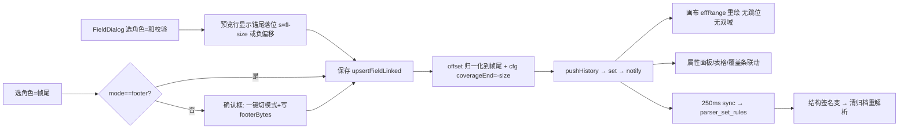

# P86 · 帧画布六项问题修复与规则联动方案（仅方案，未动代码）

日期：2026-09-16 ｜ 状态：待用户确认 ｜ 基线：P85a/b/c+补洞 四笔本地提交（`21fde47`/`98032be`/`0ba539f`/`bdb87da`，未推送）之上

> 前提说明：图1（覆盖条右侧「结」字被裁）、图2（校验域 tooltip「覆盖 0~-1 · 点击修改」）已收到并与源码对上。**P85 已解决本清单第 5 节（右键规则）的大部分**：校验覆盖拦截、尾部字段悬停高亮与可编辑、格操作置灰+原因、CK1 取消定义联动、弹窗宽度/锚点分段。本方案 = P86，处理 P85 未覆盖的六条新问题与增量规则。

---

## 一、源码现状分析（P86 相关增量，P85 文档已含全量清单）

| 主题 | 现状与证据 |
|---|---|
| 覆盖条 | `CoverageStrip`（FrameCanvas.tsx:339-378）：段宽 = `width:${len/frameLen*100}%`，`.fc-covbar`（theme.css:4006）为 flex + gap 6px，尾部 `.fc-cov-info`（4011）`white-space:nowrap` 固定文本——**段宽合计 100% + gap + 文本 → 必然溢出容器右缘被裁**（图1 现象）。文本语义 = 状态提示（「未覆盖 NB」/「结构完整」），且缺口段可点击定义字段（功能入口）。 |
| 校验字段创建链 | FieldDialog role=checksum → onOk → `upsertFieldLinked`（templateStore.ts）写 cfg `{coverageEnd: -size}`，**字段 offset 原样保存（选在哪存哪）**。渲染/引擎：定长帧用原 offset（parser.rs:682-683），变长帧强制重锚 `帧长−宽度−帧尾字`（parser.rs:684-695，effRange 同构）。骨架长 `skeletonLen`（frameLayout.ts:94-109）变长分支 `end += reservedTail` → **启用校验瞬间骨架 +1 格**。 |
| 角色↔模式联动 | 仅 LEN 有联动（upsertFieldLinked 的 `mode==="lengthField"` 分支同步 lengthOffset/size）。**role=footer 字段与 boundary.mode=footer 完全脱节**：建「帧尾字段」不会切成帧尾成帧；反之模式切 footer 而 footerBytes 空 → 只靠 Rust validate 报「缺少帧尾字节」红字（humanize 已有，但属事后报错）。role=length 建在非 lengthField 模式 = 静默孤儿字段（无任何提示）。 |
| 锚点/偏移语义 | `FieldDef.offset`：正=帧首起算，负=距帧尾（−1=最后字节）（types.ts:175、parser.rs:1035）。FieldDialog 锚点分段（P85c）+ tail 提示行；**无「起始/结束/长度」实时预览行**；属性面板有（PropertiesPanel.tsx:656-677）。新建默认锚点=帧头起算（tail 初始化仅变长帧尾部 8B 内自动勾帧尾）。 |
| 单元格尺寸 | `cellSize` = FrameCanvas 本地 `useState(28)`（:536），滑杆 18–48（:1840-1849），**不持久化、Ctrl+滚轮无处理**（onWheel 只滚行）。注意：settingsStore 已有 `cellSize`（默认 60，档位 48~110）——那是**控制画布网格**，与帧画布无关，不可混用。 |
| 帧头/校验域悬停 | P85a 后：fld 块有 accent 高亮环；hdr/ftr 块仍只有下边线+tooltip+pointer 光标；编辑入口=双击（hdr/ftr）与右键菜单（齐全）。 |

---

## 二、问题清单与优先级

**P0｜P86a 规则正确性**
1. 「结构完整」文本溢出（问题 1）——布局修正，文本保留。
2. 校验字段创建一律锚帧尾（问题 2 根修）：定长自动修到 `帧长−宽度`、变长存负偏移；杜绝「跳位/骨架追加/双份校验域」三症状；第二个 CK1 拦截并建议 CK2。
3. 角色↔截帧模式联动（问题 3）：footer 字段→确认切 footer 模式；模式→footer 预检字节；LEN 字段→提示切 lengthField 并一键同步；多 LEN/多 footer 字段/帧尾字段不在尾部——拦截+替代；`lengthOffset` 缺失时切换自动补默认。

**P1｜P86b 语义与尺寸**
4. 位置锚点语义 UI（问题 4）：FieldDialog 增「实际位置：起 s · 止 e · 长 L B」实时预览行（锚点/类型/选区变更即刷新，变长帧标注「随帧长浮动」）；锚点方向语义文案统一（帧头起算正值向帧尾、帧尾起算正值向帧头）。
5. 单元格尺寸（问题 5）：默认 42；范围 20–96 滑杆；Ctrl+滚轮缩放（±2/档）；持久化进 settingsStore 新键 `fcCellSize`（与控制画布 cellSize 分离）；设置页「帧画布」组加行。

**P2｜P86c 审计小项**
6. 帧头/校验域 hover 完整描边（与字段同款 accent，实线——虚线红线不破）；点击语义不变。
7. 工具栏撤销/重做按钮按 `undoStack/redoStack` 长度显灰（当前盲点无反馈）。
8. FieldDialog/HeadTailDialog 焦点圈定（Tab 不出弹窗）；syncError 点击附带「定位到首个问题模板」（可选）。

---

## 三、交互规则设计表（P86 增量行；P85 全表见 docs/designs/P85）

| 区域/类型 | 可选中 | 悬停高亮 | 可编辑 | 可删除 | 可插/删格 | 可覆盖 | 可锁定 | **P86 新规则** |
|---|---|---|---|---|---|---|---|---|
| CK1 和校验字段 | ✅ | ✅ | ✅（宽度锁定算法） | ✅（联动停校验，P85b） | 🚫 尾部区 | 🚫（P85a） | ✅ | **创建即锚帧尾**：定长 offset 自动=`fl−size`（toast 告知）；变长存负偏移；选区不在尾部时弹窗预览显实际落位，**不再出现字段留在中间、校验域另起一格的分裂态** |
| 第二个 CK1 | — | — | — | — | — | — | — | 拦截：「每模板仅一个校验域参与验证」+ 一键改 CK2 |
| CK2 附加校验 | ✅ | ✅ | ✅ | ✅ | 🚫 | ️ 允许（本就视觉标注） | ✅ | 定位说明补「与 CK1 一并验证」 |
| 帧尾（footer 角色字段） | ✅ | ✅ | ✅ | ✅ | 🚫 |  | ✅ | **创建成功即提议切换截帧模式=「帧头+帧尾」**（确认框，替代=取消并保留为视觉标注）；识别值/帧内字节可作 footerBytes 来源；位置必须在 `帧长−len` 起，否则拦截 |
| LEN 长度字段 | ✅ | ✅ | ✅ | ✅ | ⚠️ 位移同步 | 🚫 | ✅ | 建在非 lengthField 模式 → 提示「长度域仅在帧头+长度字段模式参与截帧」+ 一键切换（自动补 lengthOffset/size）；第二个 LEN → 拦截（长度域唯一） |
| 帧头字节 | ✅ | **✅ 补整框描边** | ✅ 双击/菜单 | 经帧头弹窗 | 🚫（overHeader 已拦） | — | — | 悬停框补齐；点击仍=选模板 |
| 校验域（无字段） | ✅ | **✅ 补整框描边** | ✅ 菜单/属性面板 | 停用校验（P85b） | 🚫 |  | — | 同上补描边 |

**问题 2 的明确回答**：校验字段**只允许锚帧尾**（定长=贴尾偏移、变长=负偏移，二者与引擎语义一致）；「中间校验」不进创建 UI，属高级场景——属性面板手动改 `coverageEnd` 为绝对正值 + 字段偏移原值，文档注明；帧尾**不再自动追加格**（骨架 +1 是校验字节的正确表示，锚尾后字段自身即尾域，ftr 重复块消失）；绝对偏移/字段长度/帧尾位置/校验域数量联动全部收敛到 `upsertFieldLinked` 单点 + `effRange` 单真相，撤销一步回滚（pushHistory 前置）。

**问题 3 冲突矩阵（拦截提示与替代）**

| 冲突 | 拦截时机 | 提示 | 替代动作 | 回退 |
|---|---|---|---|---|
| 建 footer 字段但模式≠footer | 保存时 | 「帧尾字段需配合帧尾成帧模式才参与截帧」 | 一键切模式（footerBytes=识别值/该位置帧字节）；或保留为纯视觉标注 | 确认框可取消；切换可撤销 |
| 模式切 footer 且 footerBytes 空 | 属性面板 select 时 | 「帧尾模式需要非空帧尾字节」 | 弹帧尾编辑框预填 `0D 0A` | 取消 select 还原 |
| 模式切 lengthField 且 lengthOffset 空 | 同上 | 提示并自动补 `lengthOffset=帧头长, size=1` | 一键/取消 | 撤销 |
| 第二个 LEN / 第二个 CK1 / 第二个 footer 字段 | 保存时 | 唯一性拦截 + 建议角色（data/CK2/视觉标注） | 改角色按钮 | — |
| footer 字段不在帧尾 | 保存时 | overTail(footer) 已拦（P85a），补「帧尾字段必须贴尾」文案 | 一键贴尾 | 撤销 |
| 长度域偏移<帧头长 | Rust validate 已有 | humanize 红字（已有） | 定位属性面板 | — |
| 校验被字段覆盖 | P85a 已闭环 | overTail 拦截+「取消校验并定义」 | ✅ 已实现 | 撤销 |

---

## 四、右键菜单设计表（P86 增量；P85 已实现项不重列）

| 上下文 | 菜单项 | 启用条件 | 行为 | 反馈 |
|---|---|---|---|---|
| gap/选区 | 定义为字段… | 恒有 | 弹窗；role=checksum 时**落位预览=帧尾**，保存走锚尾规则 | 弹窗预览行 + toast「校验字段已锚定帧尾」 |
| 帧头/校验域块 | （P85 已有项）+ 悬停整框描边 | — | 点击=选模板（不变） | 描边即「可操作」affordance |
| footer 角色字段 | 编辑/取消/锁定 | 恒有 | 编辑弹窗含「截帧模式」状态行 | 模式不符时弹窗顶部黄字提示 + 一键切换 |

---

## 五、UI 布局调整方案

1. **覆盖条（问题 1）**：`.fc-covbar` 拆两层——`.fc-cov-track{flex:1;min-width:0;display:flex;gap:2px;overflow:hidden}` 包裹段（段改 `flex-grow:len; flex-basis:0`，比例天然不溢出），`.fc-cov-info` 移出为轨道右邻固定元素。**结论：文本保留**（状态提示 + 缺口点击引导，删除损失功能；移进 tooltip 损失可见性）。响应式：面板再窄时段压缩（min-width 2px），info 恒完整；「未覆盖 NB」计数与 gap title 不变。影响面：仅 CoverageStrip JSX + 3 行 CSS。
2. **位置预览行（问题 4）**：FieldDialog 锚点分段下方一行 `fc-dlg-pos`：`实际位置 帧内 s ~ e · 长 L B`（等宽字体、accent 灰），tail 切换/类型变更/选区变化即时重算；变长帧后缀「随帧长浮动（当前帧长 N）」。语义文案：帧头起算=正值向帧尾；帧尾起算=正值向帧头（存储取负）。
3. **单元格尺寸（问题 5）**：滑杆 20–96、默认 42、右邻数字徽标；Ctrl+滚轮 ±2/档 clamp；持久化 `settingsStore.fcCellSize`（新增键，validate 钳 20–96，与控制画布 cellSize 互不影响）；设置页「帧画布」组加同步行。**缩放锚定策略**：格尺寸变化导致列数重排，「以鼠标点为锚」在重排布局下无定义——改为**锚定顶部可见行的首字节**（重排后 rAF 内校正 scrollRef 到含该字节的行），字节流连续性可感知、无跳感。字段映射：命中/选区/渲染全部走 layoutRef+effRange 的字节索引，与像素尺寸无关 → 偏移天然保持正确。性能：layoutBlocks 每帧 O(帧字节数) 重建（现状即如此），96px 时行数更少、成本更低；canvas 尺寸变更走既有 dpr 分支，无额外分配。

---

## 六、状态流转（P86 新增路径）

回退机制：全部经 pushHistory（50 层）；确认框可取消=零变更；模式切换与字段写入在**同一次 set**（一步撤销整体回滚）。

## 七、实施步骤 / 影响 / 风险 / 回退

| 批 | 内容 | 触达 | 风险与对策 | 回退 |
|---|---|---|---|---|
| P86a | 覆盖条布局；CK1 锚尾（upsertFieldLinked 归一化 + 多 CK1 拦截 + 预览）；footer/LEN↔模式联动（确认框 + 预检 + 自动补 lengthOffset） | FrameCanvas.tsx、templateStore.ts、PropertiesPanel.tsx、theme.css | 存量模板中间 CK1 **不迁移**（仅面板既有警告），只约束新建——避免动用户数据；确认框文案双语 | 独立 commit revert |
| P86b | 位置预览行；cellSize 42/20–96/Ctrl+wheel/fcCellSize 持久化/设置页 | FrameCanvas.tsx、settingsStore.ts、SettingsModal.tsx、theme.css | 默认 28→42 观感变化大——首帧骨架/64B 帧行数减半，验收截图确认；旧 localStorage 无此键走默认 | revert |
| P86c | 头/尾块 hover 整框；undo/redo 按钮 disabled；焦点圈定 | FrameCanvas.tsx、theme.css | 纯视觉，红线（禁虚线）不破 | revert |

Rust 零改动（引擎已支持全部语义）；parser.rs 不触 → cargo test 仅回归跑。

## 八、验收标准与测试用例

**单测（+~10）**：upsertFieldLinked 定长中间 CK1 → offset 归一 `fl-size` + toast 数据路径；变长 → 负偏移存储；多 CK1 拦截返回；footer 字段确认切模式后 boundary 同步 + 一步 undo 整体还原；模式→footer 空字节预检；lengthOffset 自动补默认；settingsStore.fcCellSize 钳制与持久化；coverageRuns/effRange 回归不动。
**浏览器烟雾**：用户复现路径逐条：①WIT/空白变长模板中间建 sum8 → 无跳位、无追加格、无中间+尾部双域，Ctrl+Z 全还原；②建帧尾字段 → 确认框 → 模式变 footer、footerBytes 正确、Rust 红字不再出现；③LEN 建在定长模板 → 提示+一键切；④覆盖条「结构完整」完整可见、窄面板不裁；⑤默认格 42、Ctrl+滚轮 20↔96、刷新保持、缩放后字节映射与悬停命中正确、拖拽/选区不受影响；⑥帧头/校验域 hover 整框；⑦撤销按钮空栈显灰。
**门禁**：tsc 0 / eslint ≤19w / vitest 全绿 / build / check:aria / check:theme / cargo 78 回归。
**交付时输出验证清单**：问题 1–6 → 测试步骤 → 预期 → 实际 → 通过与否，逐项打勾。

## 九、待确认问题

1. 「新建字段默认偏移 0」：画布框选创建时偏移=选区位置（所见即所得，0 会撞帧头）；仅属性面板「+添加」用帧头长作起点。**建议维持选区语义**，确认？
2. 格尺寸上限 96（你举例 128——96px×64B 帧单行已 6144px，再大只增滚动无增益）；Ctrl+滚轮步进 2。可调。
3. footer 字段→模式切换：确认框（推荐）还是自动切+toast？
4. 中间校验：只留属性面板高级路径（推荐），还是要在弹窗给「强制中间校验」逃生门？
5. 帧头/校验域 hover 整框描边：加（推荐，回答=有必要——affordance 缺失是实测抱怨根因；点击语义不动）。
6. P86 直接叠在 P85 四笔之上——连同此前四笔共八笔一起等你验收后 push？

## 十、额外发现（已核实，建议一并处理或入池）

- 属性面板截帧模式 select 直接改 mode，无预检（P86a 第 3 条覆盖）。
- `upsertFieldLinked` 的 LEN 联动只在 mode==lengthField 生效——与第 3 条同根。
- 覆盖条 gap 段 `all:unset` 后 title 依赖 hover，无键盘可达性——P2 池。
- 工具栏「清空归档」会连带清 diff 基线（P83 已处理）✓ 无需动。
- WIT 预设本身 11B 定长 + sum8 已贴尾（preset 无此问题）；用户复现多发生在**空白模板/变长模板**——与归因一致。
